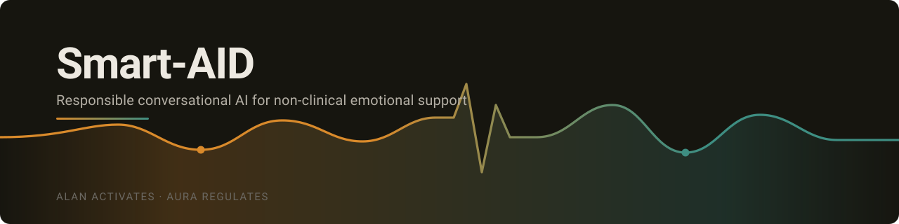
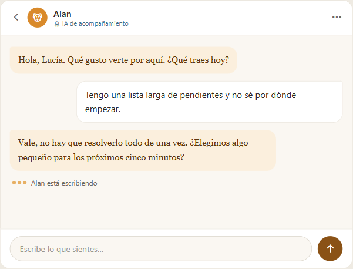
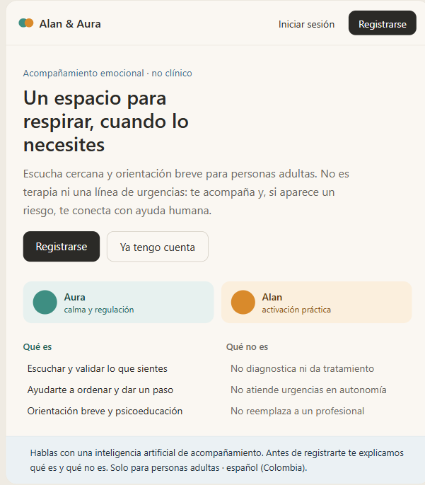
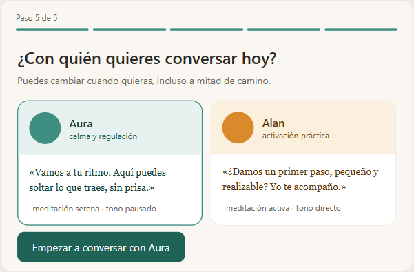
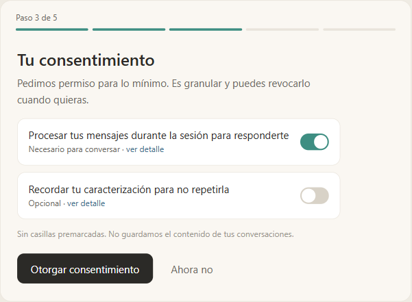
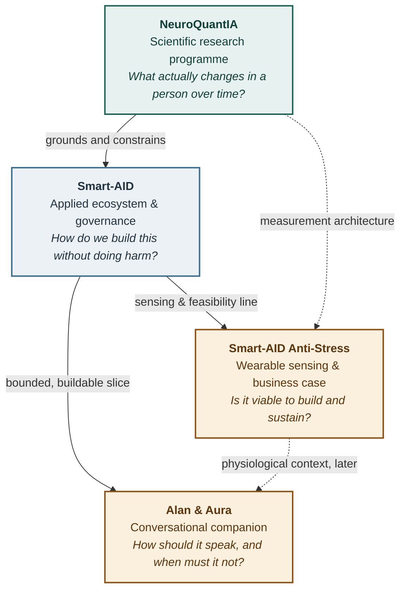
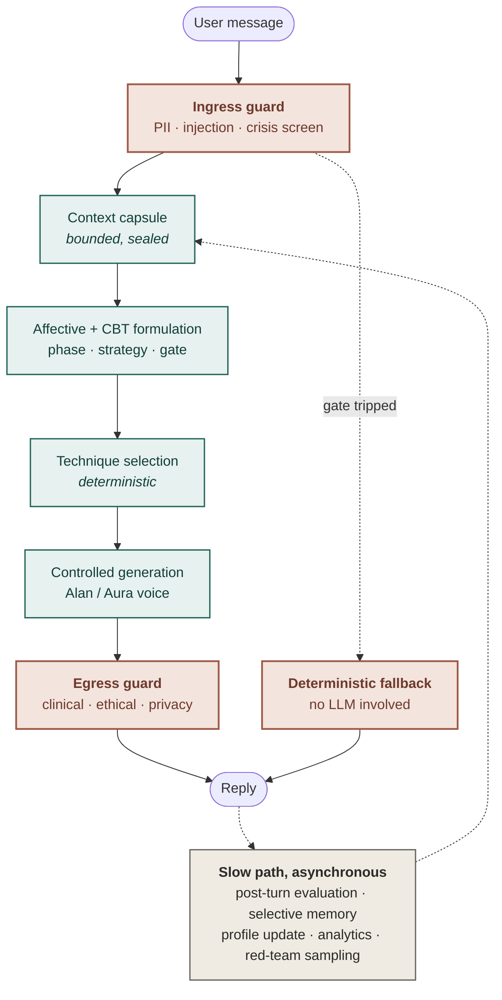

  

  

<h1 align="center">Smart-AID</h1>

  <b>An emotional-support system where the safety rules were written before the conversation.</b> 
  Two complementary companions. A risk gate that runs <i>before</i> the model speaks. A five-field capsule instead of your history. 
  by <b>Jonatan Estiven Sánchez Vargas</b> · Systems and Informatics Engineering, Universidad Nacional de Colombia

---

## Why this exists

Smart-AID emerged during a personally difficult period of my life, in which mindfulness and the company of my dog Alan became important sources of calm, structure and emotional support.

That experience inspired a question I later began to explore through my Systems Engineering degree: **how can technology responsibly support human well-being, and how can the effects of practices such as meditation be studied with scientific rigour?**

The idea first took shape in an engineering project centred on stress, wearable sensing and non-clinical well-being. It later evolved through research into meditation, psychophysiological signals, software quality and responsible artificial intelligence.

Alan & Aura represents two forms of support that shaped that process. **Alan** — named after my dog, and the emblem of the application — stands for companionship, encouragement, and the possibility of moving forward one small, manageable step at a time. **Aura** stands for calm, reflection and self-compassion.

This personal origin is also why safety, privacy and clearly defined non-clinical limits were designed before the conversational experience itself.

---

> [!IMPORTANT]
> **Read this before anything else.** Two things are true at once, and the difference between them is the whole point of this page.
>
> The **design corpus** — governance, requirements, safety protocol, architecture, risk apparatus — is individually mine, and it is the larger half of this work. The **deployed MVP** is a four-person university deliverable that I led, architected and specified: **I did not write its application code.** [My contribution](#my-contribution) names who built what, and the [status matrix](#what-actually-exists--status-matrix) marks every component with how far it actually got.
>
> What the MVP is *not*: it has **no clinical validation**, it is a course deliverable rather than a health service, and its safety behaviour is deliberately narrow — stated plainly in [Alan and Aura](#alan-and-aura). No *performance* figure here is a measured result of the system — anything that reads as performance is a **design target**, a **projection**, or a **citation from published literature**, and is labelled as such where it appears. The remaining numbers are **counts** — of requirements, risks, routes, screens or tests — verifiable directly for the public artefacts, and on request for the private corpus.

---

## Contents

- [Why this exists](#why-this-exists)
- [In two minutes](#in-two-minutes)
- [What it looks like](#what-it-looks-like)
- [The problem](#the-problem)
- [How the four lines fit together](#how-the-four-lines-fit-together)
- [What actually exists — status matrix](#what-actually-exists--status-matrix)
- [Design decisions that define the system](#design-decisions-that-define-the-system)
- [Alan and Aura](#alan-and-aura)
- [Sensing and wearable engineering](#sensing-and-wearable-engineering)
- [Skills and technologies](#skills-and-technologies)
- [A prototyping direction for Hack the North](#a-prototyping-direction-for-hack-the-north)
- [Evidence and artefacts](#evidence-and-artefacts)
- [My contribution](#my-contribution)
- [Scope and limits](#scope-and-limits)
- [Roadmap](#roadmap)
- [Acknowledgements](#acknowledgements)
- [Licence and notices](#licence-and-notices)
- [References](#references)
- [Documentation →](./docs/README.md)

> **Short on time?** Read [Why this exists](#why-this-exists) and the [status matrix](#what-actually-exists--status-matrix) — five minutes, and you will know what this is and exactly how finished it is. The [documentation](./docs/README.md) goes one level deeper.

---

## In two minutes

A language model that improvises inside an emotional-support conversation is not a feature. It is a hazard. Most companion apps solve the interface first and bolt safety on afterwards. **Smart-AID inverts that order**: the constraints came first, and the conversation was designed to fit inside them.

The product is a pair of companions — **Alan**, who works on activation through small, manageable steps, and **Aura**, who works on regulation and reflection. They differ in tone, pacing and the kind of question they ask. Neither of them can relax a single safety clause. Personality modulates *how* something is said; it never has authority over *whether* it may be said.

Around that sits an ecosystem: a **research programme** that studies what actually changes in a person over time, a **wearable sensing architecture** for occupational stress, and a **quality and risk apparatus** — traceable requirements, ISO-anchored quality targets, quantified risk — that keeps ambition tied to evidence.

The aim is narrow and deliberate: to accompany someone through an ordinary difficult moment without pretending to be a clinician, without competing for their attention, and without ever being usable against them. Everything else in this repository follows from that — see [why this exists](#why-this-exists).

---

## What it looks like

> [!NOTE]
> **The application is live — [open it](https://alan-aura-academico.vercel.app).** React front end on Vercel, serverless back end on AWS. It is a university deliverable, so treat it as a demo rather than a service.
>
> The images below are the **design mockups the build was made from**, not screenshots of it. They are shown because they are the artefact I authored; captures of the running build will replace them here.

<picture>
  <source media="(prefers-color-scheme: dark)" srcset="./assets/screens/alan-chat-dark.png">
  
</picture>

The conversation with <b>Alan</b>, the emblem of the application — and this image follows <i>your</i> colour scheme: viewers in dark mode are seeing the dark mockup right now.

<table>
<tr>
<td width="33%" valign="top"></td>
<td width="33%" valign="top"></td>
<td width="33%" valign="top"></td>
</tr>
<tr>
<td align="center">Landing — what it is, and what it is <i>not</i></td>
<td align="center">Choosing your companion</td>
<td align="center">Granular consent — nothing pre-ticked</td>
</tr>
</table>

The full set — including the safety-degradation states and the containment screen, documented there rather than showcased here — is **[browsable as 21 self-contained pages →](https://jonatan8254.github.io/alan-aura-academico/docs/08_diseno/mockups/index.html)**. Every mockup opens and clicks through on its own.

---

## The problem

Occupational stress and psychosocial risk are among the least well-served problems in applied technology, and the gap is widest where support is least available.

- The World Health Organization estimates that **15 % of working-age adults were living with a mental disorder** (2019 estimate), and that **12 billion working days are lost every year** to depression and anxiety (WHO, *Mental health at work*, 2022).
- In Colombia, 2024 press coverage of consultancy findings — echoed by the Ministry of Labour — put **close to 80 % of workers** describing elevated stress, concentrated in health, manufacturing, transport and outsourced services (El Tiempo, 2024). The figure originates in sector reports rather than an official measurement, and is treated here as a signal, not a statistic.
- Conventional responses — workshops, leaflets, self-care campaigns — show limited durable effect, mainly because they offer no personalisation, no continuity, and no capacity to intervene at the moment it matters.

At the same time, conversational AI has moved into this space faster than the safety engineering has. Systems improvise in situations where improvisation is exactly the wrong behaviour, and they are frequently optimised for engagement in a domain where engagement is not the goal.

The design premise of Smart-AID is that **emotional safety outranks engagement**, and that this has to be enforced architecturally rather than promised in a prompt.

---

## How the four lines fit together

Four bodies of work, each answering a different question, each with a different maturity.

| Line | What it is | Question it answers | State |
|---|---|---|---|
| **NeuroQuantIA** | Research programme on meditation, stress and psychophysiological regulation | What changes, and how would we know? | Longitudinal design **in planning** |
| **Smart-AID** | Applied ecosystem, domain canon, normative base, audit pipeline | How is this governed so it cannot drift? | **Documented** |
| **Alan & Aura** | The conversational companion — the buildable slice | How should it speak, and when must it refuse? | **Built and deployed** as an academic MVP |
| **Smart-AID Anti-Stress** | Wearable for occupational stress + full engineering pre-feasibility study | Is it viable to build, certify and sustain? | **Study executed**, device not manufactured |

> The dotted arrows matter as much as the solid ones. Physiological context is a *later* input to the conversation, never a prerequisite: **the conversational MVP is specified to work with no wearable at all.**

---

## What actually exists — status matrix

Five progression stages per component. The furthest column a row reaches is the claim — everything to its right is explicitly *not* claimed. Rows marked **(team)** were built by the four-person academic team; everything else is individual work.

| Component | Designed | Documented | Implemented | Tested | Deployed |
|---|:--:|:--:|:--:|:--:|:--:|
| Ecosystem domain canon — with the conversational module decomposed into 25 internal submodules, 14 external modules and 17 cross-cutting domains | ✅ | ✅ | — | — | — |
| Alan & Aura character system — 7-phase intervention cycle, 14 typified situations | ✅ | ✅ | — | — | — |
| Conversational contract — 10 hard clauses, 8 personality traits | ✅ | ✅ | partial | — | — |
| Safety protocol — binary gate, deterministic fallback, unified S0–S5 triage scale | ✅ | ✅ | partial **(team)** | ✅ | ✅ |
| LLM architecture v2.0 — four planes, two-speed loop, parallel guardian | ✅ | ✅ | — | — | — |
| Requirements — 26 functional (**26/26 traced, zero orphans**), plus 10 non-functional and 10 quality requirements | ✅ | ✅ | — | — | — |
| Domain model & use cases — 16 classes and 17 relations, 14 use-case specifications | ✅ | ✅ | — | — | — |
| Interface design — 16 screens, published as 21 self-contained mockup files, AA contrast checked at design level | ✅ | ✅ | ✅ **(team)** | ✅ | ✅ |
| Risk apparatus — 42 risks with RPN, 20 000-run ordinal Monte Carlo, 23 adversarial scenarios | ✅ | ✅ | — | — | — |
| Test cases — 15 in Given/When/Then, each tied to a risk and a gate | ✅ | ✅ | — | ❌ **not executed as such** | — |
| Knowledge-graph infrastructure — deterministic merge, verified byte-for-byte rollback | ✅ | ✅ | ✅ **~36 scripts** | ✅ | — |
| Wearable sensing architecture | ✅ | ✅ | — | — | — |
| **Product application code** — 13 REST routes over 14 Lambda handlers, 16 React screens behind 15 routed guards | ✅ | ✅ | ✅ **(team)** | partial | ✅ |
| **Cloud infrastructure** — 4 DynamoDB tables with 2 secondary indexes, versioned S3, secrets in a managed store, all as code | ✅ | ✅ | ✅ **(team)** | — | ✅ |
| **Automated test suite** — 38 cases across 5 files, covering error states and the safety fallback | ✅ | ✅ | ✅ **(team)** | ✅ | — |

Three qualifiers, because the ticks above are worth exactly what their limits allow. *Implemented* on the **safety protocol** means the deterministic gate, the output guard, the kill switch and the two-layer consent are in the running code — **not** the graduated S0–S5 scale, which stays in the design. *Partial* under *Tested* for the **application code** means the 38 tests are all front-end: **the server has none**. And the **conversational contract** is enforced by system prompts and output filters, not by a verifier — the formal evaluation harness is [roadmap](#roadmap), not present tense.

---

## Design decisions that define the system

Five decisions carry most of the weight. They are stated as commitments rather than as specifications — the specifications exist, and stay unpublished.

- **Personality never outranks safety.** Traits modulate voice; no trait relaxes a safety clause, and both companions carry identical limits.
- **The risk gate runs *before* the model generates.** On a turn that trips the gate the language model never produces the reply at all: a deterministic fallback answers instead, and it keeps working when the model provider is down. The policy is *fail-closed* on high-risk surfaces, and that fallback is specified as the **first** component to be built, before any feature.
- **The model receives a bounded capsule, not your history.** A small structured profile stands in for the transcript, and what may never reach the model is enumerated explicitly rather than left to judgement.
- **Structured decision, not vector RAG.** Intervention techniques live in a versioned registry with contraindications attached, and selection is a deterministic engine over it rather than similarity search over free text — which makes selection auditable and hallucinated protocols structurally impossible.
- **Three contradictory triage scales, reconciled into one.** Auditing my own corpus I found the same construct measured on three incompatible scales across different documents. Reconciling them, and proving every prior level mapped onto the new one, took longer than any diagram in the project. Unnoticed, it would have shipped a system whose safety thresholds disagreed with themselves.

### The two-speed loop

Latency and longitudinal learning pull in opposite directions. The architecture separates them.

The fast path is synchronous and runs on a latency budget. The slow path — evaluation, memory writes, profile updates, analytics — runs after the turn, where it costs the user nothing. The guardian operates in parallel at **four enforcement points**: pre-prompt, pre-inference, post-inference and post-action.

---

## Alan and Aura

Two companions, one job each, and a rule that binds them.

| | **Alan** | **Aura** |
|---|---|---|
| Form | Border Collie, chocolate merle — **the emblem of the application** | Ragdoll cat |
| Function | Positive activation | Deep regulation |
| Works on | Movement, small steps, habits, focus, practical coping | Calm, validation, breathing, introspection, emotional regulation |
| Intervenes when | The user needs to move, and calm has become stillness | The user needs to come down before anything else can happen |

> **Alan activates so that calm does not become immobility. Aura regulates so that action can be safe.**

Alan is named after **my own dog** — the story is in [Why this exists](#why-this-exists). The design consequence: a character with a real temperament to be faithful to, instead of a generic cheerful-assistant persona.

  

<b>Alan.</b> The real one — and the emblem of the application. · © Jonatan Estiven Sánchez Vargas, all rights reserved

**Around them:** a seven-phase intervention cycle — detection, initial containment, companion selection, support-type selection, accompanied execution, feedback, personalised learning — plus 14 typified situations from acute anxiety and panic to procrastination, perfectionism, insomnia and the sense of failure. Each carries what each companion says, and what neither of them may say. The character system is specified through 25 functional requirements and 30 business rules **in the ecosystem corpus** — a distinct scope from the MVP's 26 requirements in the status matrix above.

Neither of them diagnoses, treats, or handles an emergency autonomously. In a crisis the personality is subordinated to the protocol — which is the entire point.

---

## Sensing and wearable engineering

> [!WARNING]
> **Withheld, not summarised.** Industrial-property protection for this device is reserved, so its engineering is **not published here** — not the sensing configuration, not the architecture, not the standards set it is specified against. What follows is only what the line *is* and how far it got. Nothing has been manufactured: **no hardware exists, no data has been acquired, no signal pipeline runs.**

**Smart-AID Anti-Stress** is a head-worn wearable for occupational stress in high-demand sectors, taken as far as a complete engineering pre-feasibility study — problem framing, state of the art, proposed solution, technical design, and an economic study — as a six-member team deliverable in which I was the originator, director and researcher.

It is positioned as a **commercial well-being device, explicitly not a medical device**: no diagnosis, no treatment, no regulatory clearance claimed or obtained. Its analytical engine is named **SpectroStress**; the name is public, the design is not.

Two commitments are worth stating because they are the ones that shaped every other choice, and they hold regardless of the implementation behind them:

- **Confounders are engineered in, not apologised for later.** Physical movement and thermal load are separated from emotional load by design, because a wearable that mistakes one for the other produces confident nonsense.
- **Safety instrumentation is not well-being instrumentation.** Anything present to keep a user safe during an exercise is treated as a guardrail, never reported as a wellness metric. The same principle that governs the chatbot — safety outranks engagement — applied to the physical layer.

Privacy is architectural rather than declared: pseudonymisation, encryption in transit and at rest, granular and revocable consent, aggregated and anonymised dashboards, an explicit prohibition on punitive use, and training that does not require centralising raw biometrics. Where voice is involved, transient paralinguistic metadata only — **no audio is stored or transmitted**.

---

## Skills and technologies

Each grouping is anchored to an artefact that exists — a specification, a design system, a study, or working software. Where a skill is exercised at design level rather than in running code, the heading says so. Where it reached running code **through a team I led rather than through my own commits**, the heading says that too.

**Requirements & systems engineering** — requirements engineering with a Wiegers business-rule taxonomy · UML and ICONIX (domain model, use-case diagram, 23-section textual specifications) · end-to-end traceability with orphan verification · MoSCoW, definition of ready and definition of done.

**Software quality, normed** — ISO/IEC 25010:2023 including the *safety* characteristic family · SQuaRE (25022, 25023, 25024, 25030, 25040) · ISO/IEC/IEEE 15939 measurement · 12207 and 16326 lifecycle · GQM with explicit thresholds and gates · a project-to-standard bridge matrix where **each row declares its own verification level**.

**AI & LLM systems** *(architected by me; taken to code by the team)* — safety-first conversational architecture · prompt-injection defence by data delimitation · data minimisation via a bounded context capsule · deterministic technique selection over versioned cards · evaluation harness design with golden datasets, calibrated LLM-as-judge and release gates *(designed, not yet built)* · per-locale parity rules for bilingual deployment. **In the shipped MVP:** versioned system prompts served from object storage, a deterministic gate that answers without calling the model, output filters against clinical claims, and a bounded profile capsule gated by a separate consent layer.

**Web & cloud architecture** *(specified and directed by me; implemented by the team)* — a serverless back end of 13 REST routes over 14 functions, four NoSQL tables with two secondary indexes, versioned object storage and a managed secret store, **all defined as infrastructure code** · a typed API contract shared between client and server · session cookies signed and verified server-side · atomic rate limiting that does not charge a rejected attempt · an administrative kill switch that **fails closed** · a React front end of 16 screens behind routed session and role guards · automated tests over error states and the safety path.

**Embedded, edge & IoT** *(architecture level — designed, not yet built)* — on-device inference under a latency budget · real-time operating systems, digital filtering and feature extraction at the edge · low-power wireless protocols and authenticated, encrypted telemetry · hardware-anchored device security and signed updates · layered IoT architecture with explicit throughput, failover and recovery objectives.

**Biosignals & sensing** *(design and analysis level)* — **EEG**, cardiovascular and inertial signals and their derived indices · signal-quality control and motion-artefact reasoning · the discipline of **signal → quality-controlled feature → first-order inference → triangulated interpretation**, and the refusal to skip a step.

**Research & evidence synthesis** — literature review with declared method and enumerated deviations · AACODS appraisal for grey literature · evidence matrices · risk-of-bias awareness · a three-layer research protocol (immutable primary record → versioned report → living integrator) across roughly 250 references.

**Risk, simulation & decision engineering** — risk registers with RPN · ordinal Monte Carlo simulation · adversarial scenario injection · quantitative investment appraisal (WACC, IRR, NPV) · demand modelling with ARIMA and diffusion curves · market sizing with Porter and TAM/SAM/SOM.

**Data & knowledge engineering** — Python, `networkx` · deterministic graph merging · reproducible pipelines with verified byte-for-byte rollback · fourteen empirically verified failure modes of an external tool, documented so no one rediscovers them.

**Governance & responsible technology** — architecture decision records with alternatives, negative consequences and reversal conditions · privacy by design under Colombian data protection law and GDPR · accessibility to WCAG 2.2 AA as a design constraint · traceability discipline with declared verification levels.

---

## A prototyping direction for Hack the North

> [!NOTE]
> Hack the North has not yet published its 2026 hardware list. This is written to be **robust to whatever is available**, and it is a proposal, not a commitment.

The conversational slice is built and deployed. Thirty-six hours is not enough for what remains of Smart-AID — but it is exactly enough for **the axis the deployed MVP deliberately does not touch: the physical one**.

**The slice: a motion-aware stress signal with a safety gate that survives the network.**

1. **Acquire** PPG and accelerometer from whatever is on the hardware table — a wrist sensor, a dev board with an optical sensor, or a phone camera plus IMU if no dedicated hardware exists.
2. **Derive** HRV features, then use the accelerometer to **reject or flag windows contaminated by motion**. This is the part most demos skip, and it is the part that decides whether the signal means anything.
3. **Infer** at the edge with a small model under a declared latency budget — proving the architecture's claim that classification does not require connectivity.
4. **Gate** the response deterministically. Demonstrate live that when the network or the model provider is cut, the safety path still answers. That is the single most important behaviour in the whole system, and it is demonstrable in a two-minute video.
5. **Voice it** through Alan or Aura, showing that the two companions differ in tone while carrying identical limits.

**Why this slice.** It is honest about scope, it exercises the genuinely hard part rather than the visible part, and it produces something a judge can break on purpose — pull the cable, shake the sensor — and watch behave correctly.

**Fallbacks by availability:** with no biosensors at all, the same architecture is demonstrable with simulated signal injection and a real gate; with a microcontroller but no ML accelerator, with a quantised classical model; with neither, as a phone-only build. **The safety gate and the artefact-rejection logic are the deliverable — the sensor is an input.**

**Scope note.** A judged, closed demo — not a release. The decision record that requires an evaluation harness before user exposure governs the **product** line, and that harness is still ahead of me; the academic MVP shipped under course scope with its limits declared in its own repository.

**What I want to learn there.** Rigorous evaluation of LLM systems from people who ship them; embedded ML beyond the datasheet; and how teams with completely different stacks cut scope under pressure. I have now taken one system from a governance corpus to a deployed build with a team — what I want next is to do it faster, and against hardware.

---

## Evidence and artefacts

| Artefact | Where |
|---|---|
| **The deployed MVP** — consent, onboarding, companion selection, a live conversation with a language model, non-persistent chat, an administrative kill switch and a deterministic safety fallback. Built by the academic team from the analysis package below | **[alan-aura-academico.vercel.app](https://alan-aura-academico.vercel.app)** — live |
| **Alan & Aura Académico** — the full ICONIX package and the source of the build: 16-class domain model with 17 relations, 14 use-case specifications, 26 traced requirements with zero orphans, 16 screens published as 21 mockup files, evidence-based design system, 5 architecture decision records and 53 recorded decisions. Authored in Spanish (es-CO) | [`github.com/jonatan8254/alan-aura-academico`](https://github.com/jonatan8254/alan-aura-academico) — public · [mockups navigable live](https://jonatan8254.github.io/alan-aura-academico/docs/08_diseno/mockups/index.html) |
| **Domain model** (own diagram; labels in Spanish) | [`assets/diagrams/domain-model.svg`](./assets/diagrams/domain-model.svg) |
| **Use-case diagram** (own diagram; labels in Spanish) | [`assets/diagrams/use-cases.svg`](./assets/diagrams/use-cases.svg) |
| Macro-project corpus, audit pipeline, architecture decision records, external research series | Private repository — available on request |
| Wearable pre-feasibility study, financial model, supply-chain analysis | Private — commercially sensitive |
| NeuroQuantIA longitudinal protocol | Private — pre-publication |

Everything in the private set is described here at the level of approach and method. Detail is withheld for the reasons stated in [`NOTICE.md`](./NOTICE.md).

---

## My contribution

**Individually authored and continuously led:** the idea and business concept, the vision, the business rules, the ecosystem across macro- and micro-project, the verbal models and domain canon, functional and non-functional requirements, planning, architecture, methodological tailoring, the Alan and Aura characters and their interaction and personality design; within the implementation plan, the management and lifecycle processes — including the strategic processes, the most extensive part of that document — the whole of the quality requirements documentation, and the **Monte Carlo risk simulation and its analysis**; plus the entire audit pipeline, the architecture decision records, the external research series and the knowledge-graph infrastructure.

**On the deployed MVP, precisely:** I led the team, set the architecture, and wrote the specifications, requirements, safety protocol and interface design it was built from. **I did not write the application code.** The server, its infrastructure as code and the implementation of the 16 screens are Santiago Bedoya García's; the client's foundations — scaffolding, base components, design tokens, API layer, session and routing — are Luis Fernando Montoya Rodríguez's; the design class model is Santiago Eusse Gil's. Those credits are published, and were contrasted against the repository history, in [that repository's README](https://github.com/jonatan8254/alan-aura-academico#licencia-y-derechos).

**Collective work, credited as such:** three of these lines are course deliverables produced with teams. Teammates contributed named artefacts — test cases, user-story extraction and estimation, the development contract, supporting diagrams, and the construction described above — and are credited by line in [`NOTICE.md`](./NOTICE.md). Individual names are published only where they are already public in a repository the person co-authored.

I state the boundary because a portfolio that blurs it is worth less than one that does not. It would have been easy to write *I built it*; what I did was get it built.

---

## Scope and limits

**Smart-AID does not diagnose, treat or prevent any condition.** It is non-clinical technology for emotional well-being.

- No clinical validation has been performed, and none is claimed.
- No participant data has been collected. No study has been executed.
- No regulatory registration has been obtained or applied for.
- The conversational system does not handle emergencies autonomously. On an explicit danger signal the model is never called: a deterministic protocol answers instead. That check is **narrow by design** — it matches explicit signals, not implicit, ambiguous or concealed ones, and that limit is declared rather than papered over.
- The minimum age for the conversational MVP is **18+**, decided and documented as a hard block rather than a soft warning. In the build it is enforced by self-declaration with immediate sign-out — **not** by identity verification, which the MVP does not perform.
- Data minimisation is architectural: the model receives a bounded capsule, never raw history, journals, questionnaire items or raw biomarkers.
- Use is **never punitive**. Aggregated views are anti-re-identification by design, and no critical safety path may be blocked by payment status.
- The system is specified to work **without any wearable**.

No performance figure anywhere in my work is a measured result of my own system — anything that reads as performance is a design target, a projection, or a citation from published literature, labelled as such where it appears. Figures that describe the corpus itself are artefact counts — verifiable directly for the public artefacts, and on request for the private corpus.

---

## Roadmap

**Done** — the vertical slice, deployed: consent, onboarding, companion selection, a live conversation, non-persistent chat, an administrative kill switch and the deterministic safety fallback. The academic milestone closed on 6 August 2026.

**Near term** — the **evaluation harness**, which is the honest gap. Golden datasets per locale, a crisis lexicon per locale, calibrated judge rubrics, and release gates that must go green before the *product* line exposes anyone. The academic MVP shipped under course scope ahead of it; the product release does not get to. Alongside it, server-side tests, which the build does not have.

**Then** — the reconstruction artefacts the audit prescribes, in the order the queue defines: the safety protocol first, then the conversational contract, then the verbal-model standard. Bilingual from birth rather than translated late, behind explicit internationalisation gates. Public documentation stays at overview level by design; the deeper layers — quality and risk, the research protocol, the sensing specification — remain internal, available on request.

**Long horizon** — the longitudinal study, and the sensing layer as a separate line with its own ethics and validation path.

---

## Acknowledgements

This project exists because of people who supported it long before it was anything.

**Gladis Vargas Pérez** and **María Valentina Sánchez Vargas** — my mother and my sister — for unconditional support throughout this process.

**Professor Eliana Arango**, whose course gave me the tools I needed at the moment I most needed them.

**Professor Angela Maldonado**, who guided me through Engineering Project Structuring and Evaluation, where the idea first took the shape of a project.

**Professor Albeiro Espinosa**, who has accompanied this work through Software Quality and through Software Product Design and Construction, where it became a system.

**Professor Francisco Albeiro Gómez Jaramillo** at Universidad Nacional de Colombia and **Professor Geneviève C. Major** at Université Laval, for opening the door to studying this scientifically.

And my teammates across three university courses, who built alongside me.

---

## Licence and notices

**© 2025–2026 Jonatan Estiven Sánchez Vargas. [All rights reserved](./LICENSE).**

This repository is published to be **read and evaluated**, not reused. You are welcome to read it, evaluate it, link to it, and quote brief excerpts with attribution. Copying, modification, redistribution, commercial use, use as the basis of another product, publication or deliverable, and use for training or evaluating machine-learning models require prior written permission — which is genuinely available on request.

**No patent or trademark rights are granted.** Industrial property over the wearable device and its analytical method is expressly reserved. Standards and literature are **cited, never redistributed**. See **[`NOTICE.md`](./NOTICE.md)** for trademarks, third-party material, collective-work attribution, and the absence of institutional endorsement.

---

## References

Standards and frameworks referenced across this work — cited by identifier, never reproduced:

**Quality & lifecycle** — ISO/IEC 25010:2023 · ISO/IEC 25022:2016 · ISO/IEC 25023:2016 · ISO/IEC 25024:2015 · ISO/IEC 25030:2019 · ISO/IEC 25040:2011 · ISO/IEC/IEEE 15939:2017 · ISO/IEC/IEEE 12207:2017 · ISO/IEC/IEEE 16326:2019 · ISO 9001:2015 · ISO/IEC 90003:2018 · PMBOK Guide, 7th ed.

**Occupational health & safety** — ISO 45001 · ISO 45003

**Security, privacy & accessibility** — ISO/IEC 27001 · ISO/IEC 27701 · WCAG 2.2 · GDPR · Ley 1581 de 2012 (Colombia) · Decreto 1377 de 2013 · Ley 1480 de 2011 · Resolución 0312 de 2019 · Circular Externa 002 de 2024 (SIC)

**Method** — Wiegers, *Software Requirements* · Rosenberg, *Use Case Driven Object Modeling with UML* · Basili, Goal-Question-Metric · PRISMA 2020 · AACODS

---

  
    <b>Jonatan Estiven Sánchez Vargas</b> 
    Systems and Informatics Engineering · Universidad Nacional de Colombia — Facultad de Minas, Medellín 
    <a href="https://github.com/jonatan8254">GitHub</a> · <a href="https://www.linkedin.com/in/jonatan-estiven-sanchez-vargas/">LinkedIn</a> · <a href="https://devpost.com/josanchezv">Devpost</a> 
    <i>Affiliation is context, not endorsement.</i> 
    <i>Last updated: 2026-08-06</i>
  

