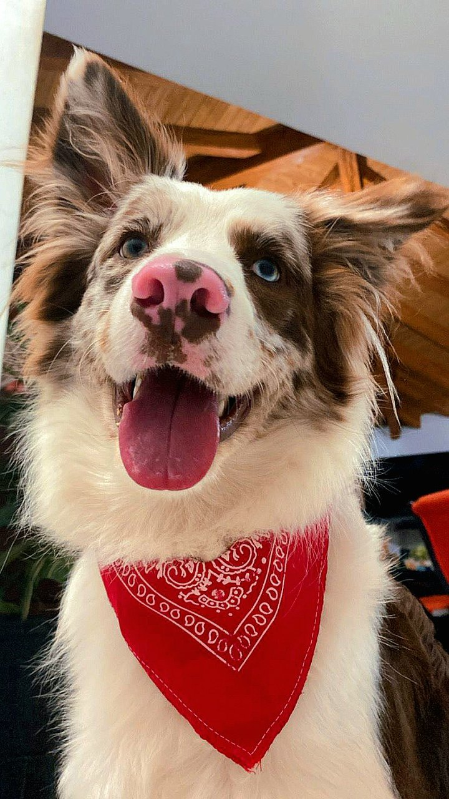

# Alan & Aura — two companions, one rule

> **Status:** `DOCUMENTED` (character system) / `DEPLOYED` (interaction and interface, built by the academic team). This page is a general portrait; the character specification lives in the internal corpus, with an MVP-level contract public in [`alan-aura-academico`](https://github.com/jonatan8254/alan-aura-academico) and the build itself at [alan-aura-academico.vercel.app](https://alan-aura-academico.vercel.app).

## Who they are

| | **Alan** 🐕 | **Aura** 🐈 |
|---|---|---|
| Form | Border Collie, chocolate merle — the emblem of the application | Ragdoll cat |
| Offers | Positive activation — movement, small steps, habits, focus | Deep regulation — calm, validation, breathing, introspection |
| Steps in when | Calm has become stillness, and the person needs to move | The person needs to come down before anything else can happen |

> **Alan activates so that calm does not become immobility. Aura regulates so that action can be safe.**

Alan is named after the author's own dog — the origin is told in [Why this exists](../../README.md#why-this-exists). The design consequence is practical: the character has a real temperament to be faithful to, instead of a generic cheerful-assistant persona.

  

<b>Alan</b> — the emblem of the application. © Jonatan Estiven Sánchez Vargas, all rights reserved.

## How an intervention flows

The character system defines a **seven-phase intervention cycle** — detection, initial containment, companion selection, support-type selection, accompanied execution, feedback, personalised learning — and **fourteen typified situations**, from acute anxiety and panic to procrastination, perfectionism, insomnia and the sense of failure. Each situation specifies what each companion offers **and what neither of them may say**. The phases and situations are named here; their scripts and rules are part of the internal specification.

## The rule that binds them

The companions differ in tone, pacing, and the kind of question they ask. They do not differ in limits:

- **Personality modulates *how* something is said; it never decides *whether* it may be said.**
- Both carry **identical safety limits** — no trait, however warm or energetic, relaxes a single clause.
- **In a crisis, the personality is subordinated to the protocol.** The warm voice yields to a deterministic safety path — humour, play and metaphor are suspended. This is not a limitation of the characters; it is the point of them.

## What they are not

Neither companion diagnoses, treats, or handles an emergency autonomously. They are non-clinical companions for ordinary difficult moments — the [safety approach](./safety-approach.md) explains where their competence deliberately ends.

---

*Back to [documentation index](../README.md).*
